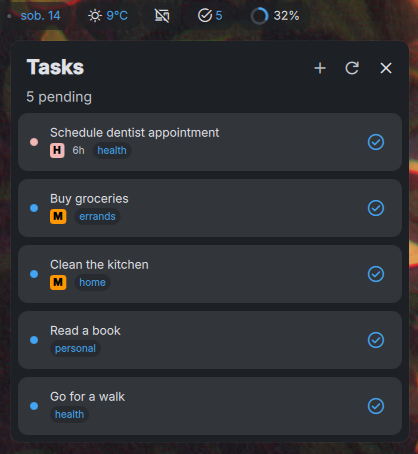

# Taskwarrior for DMS

A DankMaterialShell bar widget that shows your pending Taskwarrior tasks sorted by urgency.



## Features

- Pending task count in the bar (horizontal and vertical layouts)
- Show top 10 tasks sorted by urgency
- Add new tasks using Taskwarrior syntax (e.g. `Buy milk +shopping priority:H`)
- Mark tasks as done with a single click

## Requirements

- [Taskwarrior](https://taskwarrior.org/) — the `task` CLI must be in PATH

## Installation

### Via DMS Settings (recommended)

1. Open DMS Settings → Plugins
2. Click "Scan for Plugins"
3. Find **Taskwarrior** and enable it
4. Add the widget to the bar

### Manual

```sh
git clone https://github.com/cyrylas/dms-taskwarrior ~/.config/DankMaterialShell/plugins/taskwarrior
```

Then scan and enable in DMS Settings → Plugins.

## License

MIT License - see [LICENSE](LICENSE) file for details.

## Credits

- **Author**: Michał Wazgird - *cyrylas*
- **DankMaterialShell**: [DankMaterialShell Project](https://github.com/AvengeMedia/DankMaterialShell)
- **QML/Qt**: [Qt Project](https://www.qt.io/)

## Support

For issues, questions, or feature requests:

- Open an issue on GitHub

## Roadmap

- [ ] Filter/search tasks
- [ ] Group tasks by tags

